# Adding Offline Sync to your Azure-Backed Xamarin.Forms App 
 

## Exercise 1: Add SQLite to your solution	
## Exercise 2: Implement Offline Sync	

 
 
 **Lab Prerequisites**
1)	Visual Studio 2017 with Xamarin. 
2)	An active Microsoft Azure account. {Ask your Lab Moderator about your Azure Pass 
Code} – No Credit Card is required, if you created your Azure account using Azure Pass Code 
3)	Visual Studio Emulator for Android  / x86 Emulator / An Actual Android Device
4)	Complete Lab 01 
 
Estimated Time to finish this lab is from 30 minutes 
 
 
## Exercise 1: Add SQLite to your Solution 
1) Click on Tools -> NuGet Package Manager -> Manage NuGet Packages for Solution  
  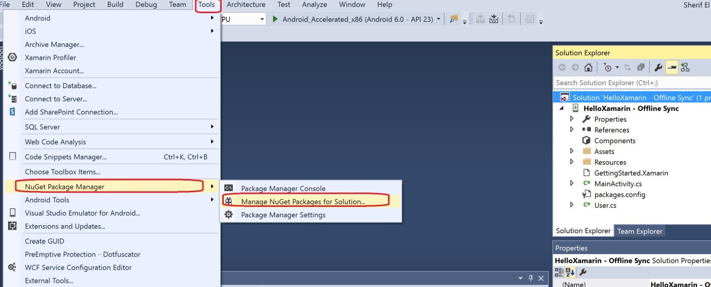
 
2)	Click on Browse, write “sqlite azure” in the search box, scroll till you find 
“Microsoft.Azure.Mobile.Client.SQLiteStore”, click on it then select your project then click Install ((Please note due to some nuget issues currently the stable version 4.0.0.0 doesnt work so install the 3.1 version))
  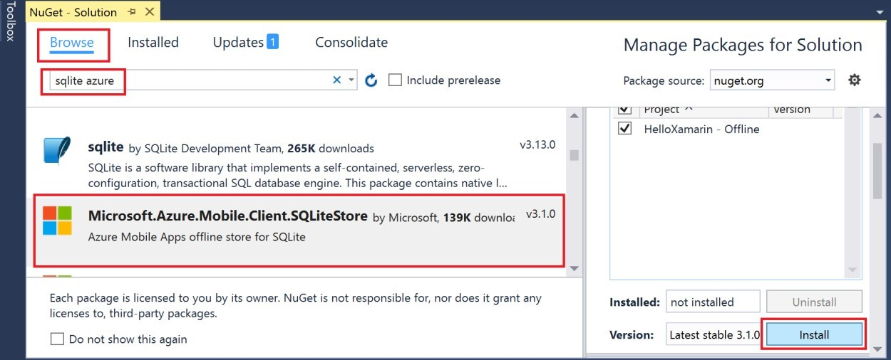
  
 
3)	Click OK then Accept to start installing the package 
  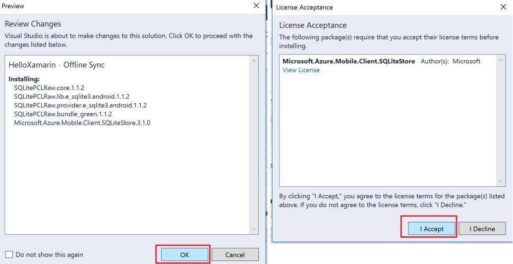
  
4)	Wait till the package is successfully installed 
  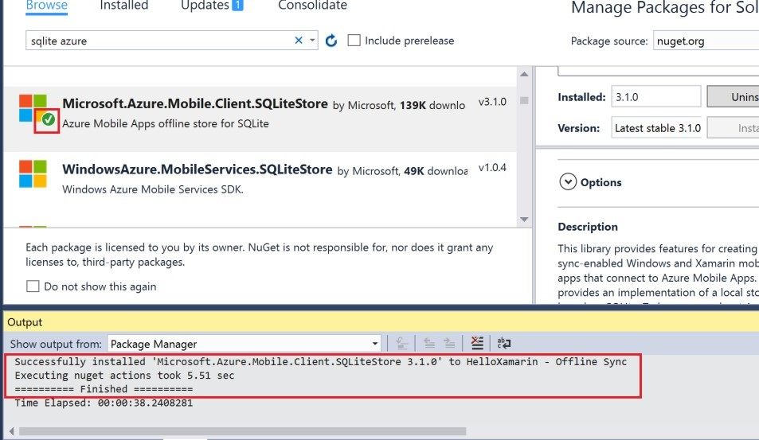
  
## Exercise 2: Implement Offline Sync 

1)	Go to MainPage.xaml and add the code below 
```
<Button Text="InsertOffline" Clicked="Button_Clicked_1"/>
 ```
  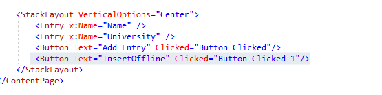
2)	Rebuild your solution 
  
  
 
3) Add the following namespaces to MainPage.xaml.cs 
```
using System.Threading.Tasks; using Microsoft.WindowsAzure.MobileServices.SQLiteStore; 
```
 
     
4) Add the following method in MainPage.xaml.cs 
```
private async Task<bool> InitLocalStoreAsync() 
{ 
    if (!MobileService.SyncContext.IsInitialized) 
    { 
       var store = new MobileServiceSQLiteStore("localstore.db");        
       store.DefineTable<User>(); 
       await MobileService.SyncContext.InitializeAsync(store);     
       return true;  
    } 
    return false; 
} 
``` 
  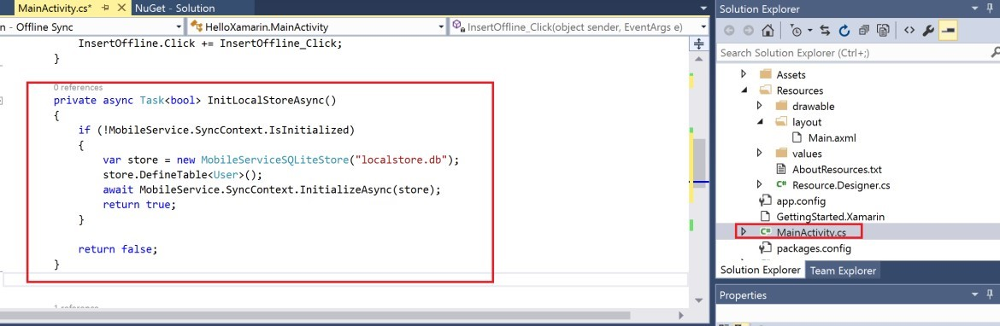

  
5)	Add a new method as onLoad 
```
    private async void onLoad()
    {
      	 await InitLocalStoreAsync();
    }
``` 
6)	call this function below the InitializeComponent();
  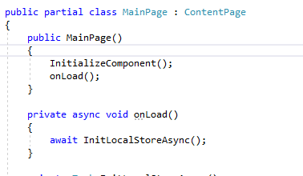

 
 
7) Add the following namespace in MainPage.Xaml.cs 
```
using Microsoft.WindowsAzure.MobileServices.Sync; 
```
8)	Declare an object mapping User table but this time it’s sync table 
```
public IMobileServiceSyncTable<User> UserSyncTable { get; set; } 
```  
9)	Initialize your UserSyncTable object by adding the following code in onLoad method 
```
UserSyncTable=MobileService.GetSyncTable<User>(); 
 
``` 
  
 
10)	Add the code in the event handler of the button “Button_click_1” that we added in step 1 
```              
            User newUser = new User(); 
            newUser.Name = Name.Text; 
            newUser.University =University.Text; 
            await UserSyncTable.InsertAsync(newUser);  
```
 
11)	Rebuild your solution then Run it  
 
  
12)	From your Android Emulator, go to Settings. (The emulator used here is 5.5” Marshmllow (6.0.0) XXHDPI Phone (Android 6.0 – API 23)) – Feel free to use any other emulator 
 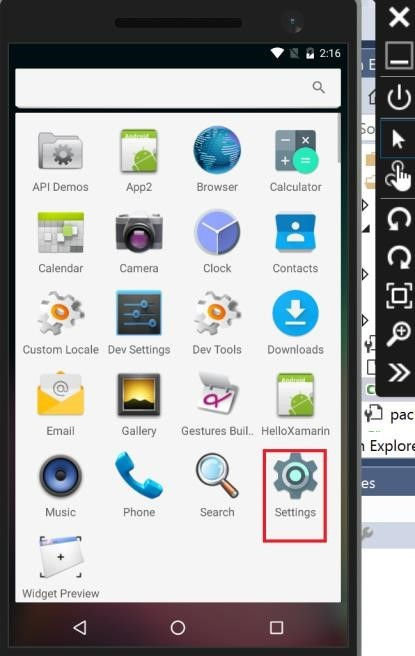
  
 
13)	Click on More then enable the Airplane Mode 

 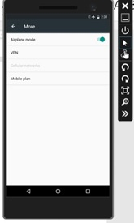
  
14)	Now go back to the home page and open our HelloXamarin app or the app name you created
   
 
15)	Now let’s try to insert a new record where there is no internet connectivity using the normal insert button (the one with no offline sync support) 
  
  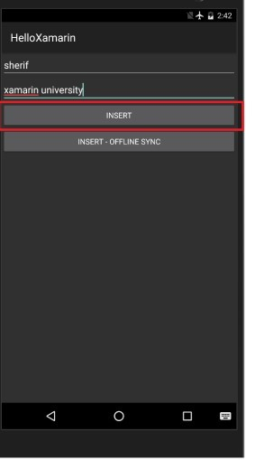
 
16)	The app will crash as shown below 
   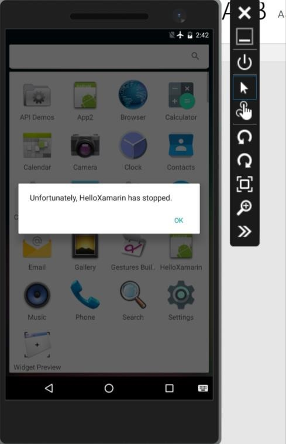
 
17)	Re-Open the app but this time insert the record using the new button “Insert-Offline Sync” that we added in this exercise. 
   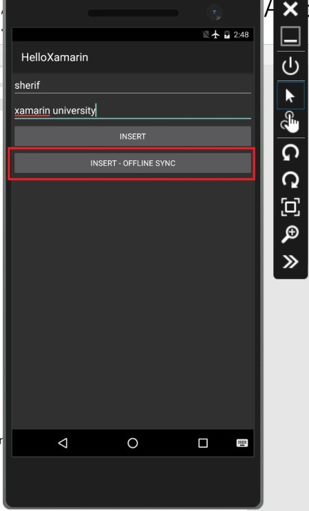
 
18)	The app won’t crash and it will save the record in the local database; the one we initialized and invoked in step 5 & 6. 
 
19)	Now, how to synchronize local changes with your Azure Mobile App when the app is back online? 
 
 
20)	Go to MainPage.xaml and add the code below 
   
```   
<Button Text="Push to Cloud" x:Name="Pushtocloud" Clicked="Pushtocloud_Clicked" />
``` 
 
21)	Rebuild your solution  
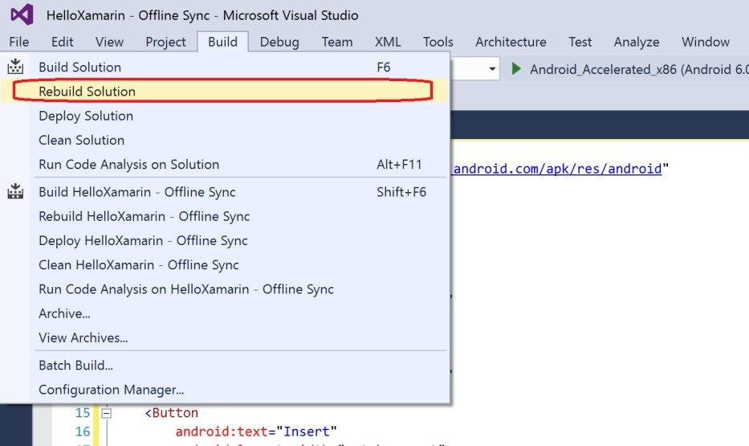  
 
  
 
 
 
22) From your Android Emulator, go to Settings and disable Airplane Mode 
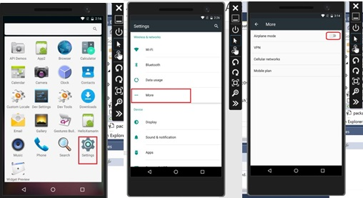  
  
24)	Go back to MainPage.xaml.cs and add the event handler of the button we just added in step 20. Create this event handler if Visual Studio doesnt create it for you already.
``` 
  private void Pushtocloud_Clicked(object sender, EventArgs e)    { 
       await MobileService.SyncContext.PushAsync();  } 
```
 
 
25)	Rebuild your solution then Run it  
  
  

26)	Just click on Push Local Changes to Cloud without adding any other input 

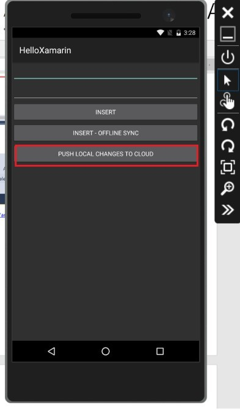  

 
27)	Navigate to your Azure portal, go to your Resource Group then select your Azure Mobile App Backend then scroll down and click on Easy Tables -> Table User  

  

28)	You should be able to see that locally saved record is now pushed to the db on the cloud 
  


29)	In addition to the Push command that we just tried, you can try the following sync commands as well. 
  
```
PushAsync(), PullAsync(), PurgeAsync();
```